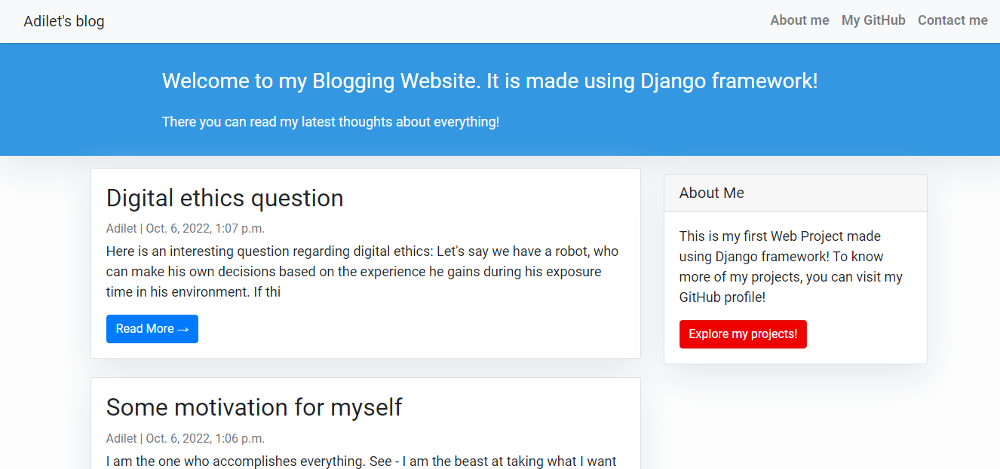
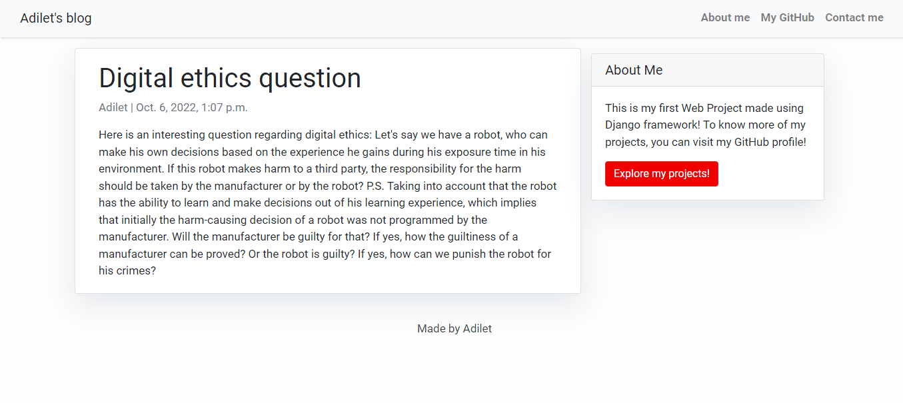
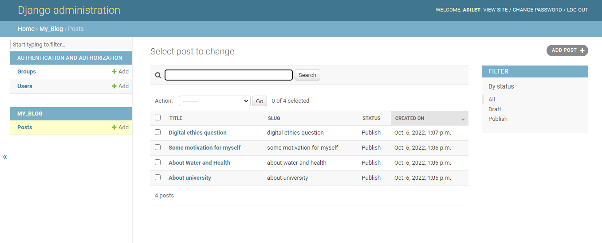

# BloggingApp
## Description

### This is a Blogging Website that allows the Author to publish posts using Django administration site.

### It contains 2 pages:

- **index.html**, it is a main page with all posts ordered by date in a descending manner, so that latest posts are at the top.

- **post_detail.html**, it is a page that shows the details of a particular post.

It has one Database table *Post*, which contains attributes like *title*, *author*, *slug*, *author*, *content*, and etc.

## Technologies used:
 - Frontend: HTML, CSS, Bootstrap
 - Backend: Python, Django

### The Main Page

---------------------------------------------

### The Post Detail Page

---------------------------------------------

### Administration Site

 